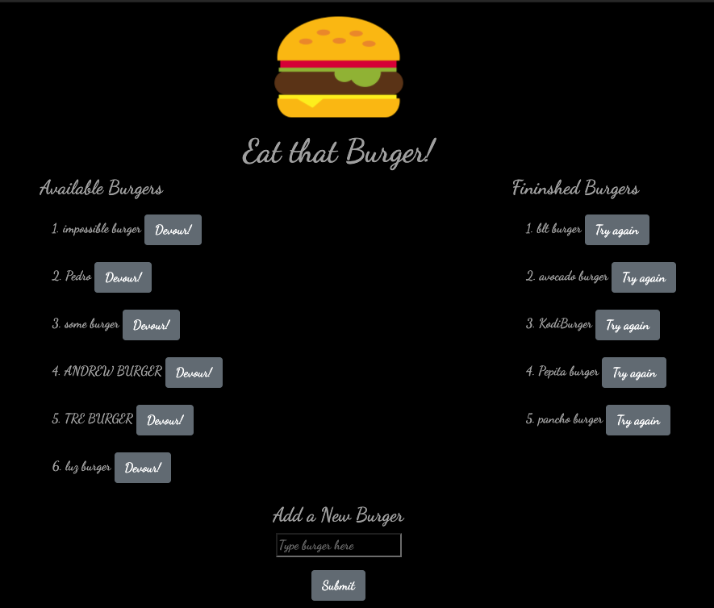

  # Burger

   ### [Deployed Buger App link !](https://secure-beyond-70824.herokuapp.com/)

  ## Description 
  The Burger app will help you keep track of your burgers with an organized layout. The MVC design pattern is utilized for an orgnaized file structure. Node and MySQL query and route data to the client side where Handlebars generate HTML.

  [](public/assets/img/burgerScreenShot.png)

  ## Table of Contents

  * [Installation](#installation)

  * [Usage](#usage)

  * [Build](#build)

  * [Questions](#questions)

  ## Installation
  To install required dependencies, run the following command:

  ```npm i```

  ## Usage
  User may input a new burger underneath "Add a New Burger" and click submit 
  
  Then the new burger will appear on the "Available Buger" list 
  
  Once may devour their burger by clicking on the "devour" button
  
  Next off, the devoured burger will move to the "finished burger" list
  
  lastly, user may click try again button on any finished burger to move back to the "Available Burger" section

  Follow the Deployed link: </br>
  [Buger App link](https://secure-beyond-70824.herokuapp.com/)

  Or run following command on local machine: 

  ``` node server.js```

  ## Build 
  **Tools Used :** </br> JavaScript JQuery express-handlebars mySql Node HTML CSS Heroku JawsBD

  **MVC Paradign:** </br>
   The Model View Controller, or MVC paradign, allows developers to breakdown code into modules for better organization and reusability. 

   Model</br>
    Works with the data of the apllication. In the Burger app, the model folder (burger), is exported with all methods applied from the orm file. The orm file is object-relational mapping that creates reusable methods, querying the database. 

   Views</br>
    The type of html content that's rendered. In this case, express Handlebars.js is the template engine implemented to create dynamic html. The views folder contains the index.handlebars file where the handle bars' expressions are setting the data. In the partial folder, a burger parital, which creates the list item, is applied to the index.handlebars.
   
   Controller</br>
     The middleman between the Views and the Model. The Controller takes the user's input and interacts with the Model to create, read or update , and return the results of the query to the client-side. 

  ## Questions
  If you have a question about this repo, open a issue or contact Laura915 

  